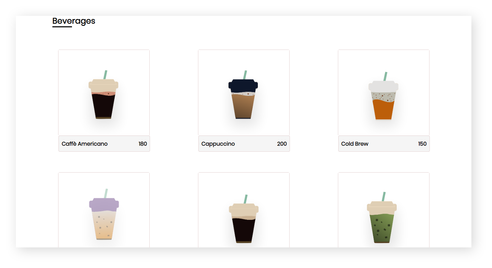
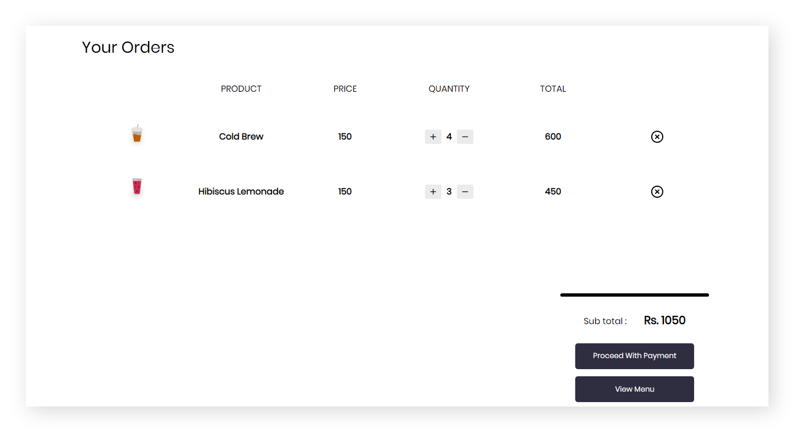

# ProGrad

## LAB | ProGrad Shopping Cart
Phineas and Ferb are brothers they are known for the experiments they make, and they've got a treehouse where they spent their spare time, Inside the treehouse, there is a mini-refrigerator which they've made which consists of beverages. One Sunday Phineas and Ferb were playing with their pet Perry the platypus. After playing for a long time, they're tired. Phineas asked, Ferb can we have a drink? Ferb replied the refrigerator is empty.

They're tired, of taking a call to the departmental store as this kept happening frequently. Phineas says we should solve this problem. Ferb replies, yep. They have planned to build an application, specifically for ordering beverages. They need **YOU** to help them build this application. Go to the `src/app.js` file and complete all the unfinished code to propel both of these young champ's desire.

## What should you do?

- Fork this repo
- Clone this repo
- Practice JavaScript Oops -  _classes, objects, member variables, member functions,composition_

## How do you submit?

- Upon completion, run the following commands:

  ```
  git add .
  git commit -m "prograd ID"
  git push origin master
  ```

- Create a pull request so your teaching mentors can check your work.

## Starter code

The `src/app.js` contains an array of 10 items and another array containing all the 10 items prices. We are talking about the array of 10 _strings_ and _numbers_ each containing beverage names and its prices. Here is one example of how the data is displayed:

ITEMS 
```javascript
[
    'Caffè Americano'
]
```
PRICE
```javascript
[
    180
]
```

### Tests

Ohh yes! We have our beloved tests, and you already know how this works. Open the `SpecRunner.html` file on your browser and start coding to pass the test. Remember to focus on one test at a time and read carefully the instructions to understand what you have to do.

## Trial 1: TAKE IT ! OR LEAVE IT !

Phineas and Ferb has collected a list of menu items and their prices based on  available menu items present around their location. Help them implement these menu items into the application.Create a class for `MenuItem` such that each item takes id,name and price as argument.

* image can be sequential i.e. "assets/product-"+(i+1)+".png"
* It should _return an array of `MenuItem` objects_.
    ```JS
        [
            { 
                'id' :1,
                'name' : 'Caffè Americano',
                'image' : '../assets/product-1.png',
                'price' : 180
            }
        ]
    ```    

* `getItem()` should accumulate HTML template as below and _return that HTML element_.

    ```JS
    <div class="item" data-id="3">
        
        <div class="overlay"></div>
        <button class="add-cart-btn">Add To Cart</button>
        <div class="cart-footer">
            <b class="name">Cold Brew</b>
            <b class="price">150</b>
        </div>
    </div>
    ```

## Trial 2: CHOOSE WISELY !

Phineas and Fearb now wants to add those `MenuItems` into Menu. Create a class `Menu`, it should loop through passed constant items and price array and such that it contains `items` and `cart` properties.

* `items` should be an array of `MenuItem`.
* `cart` should hold the instance of Cart.
* `displayCatalogue()` should _return an array of HTML elements_ each element should be accumulated from `MenuItem`.`getItem()` method.

## Trial 3: MORE ITEMS ! MORE DSICOUNT !

Add the logic to `addToCart()` method such that it should _return an updated cart list_ after adding a valid menu item to cart. If item already present, then update quantity and total of that item.

## Trial 4: FILL IT LIKE NEVER BEFORE !
 
Create class for `Cart` such that it contains a list and total properties.

* Add logic to `displayCart()` method such that it should _return an array of HTML elements_

```JS
[
    thumbnail,product,price,quantity,total,remove
]
```
* thumbnail 
```JS
<div class="thumbnail" id="thumbnails">
    <span class="image-head"></span>
    <span class="thumbnail-img">
        
    </span>
</div>
```

* product
```JS
<div class="product" id="products">
    <span class="product-head">PRODUCT</span>
    <b class="product-name">Cold Brew</b>
</div>
```

* price
```JS
<div class="price" id="prices">
    <span class="amount-head">PRICE</span>
    <b class="amount">150</b>
</div>
```

* quantity
```JS 
<div class="quantity" id="quantity-holder">
    <span class="qty-head">QUANTITY</span>
    <i data-feather="plus" class="plus">
    <b class="qty" data-id="11"></b>
    <i data-feather="minus" class="minus">
</div>
```

* total
``` JS
<div class="total" id="total-holder">
    <span class="total-cost-head">TOTAL</span>
    <b class="total-cost" id="total-of-item-3">450</b>
</div>
```
* remove
```JS
<div class="remove" id="remover">
    <span class="remove-icon-head"></span>
    <b class="remove-icon" data-id="3">
    <i data-feather="x-circle"></i>
    </b>
</div>
```


In class `Cart` it should have a `list` array member variable to store all the wishlist of user and a member variable total which will have the grand total of all the items in the cart.

* Add logic to `displayCart()` method such that it should _return an array of HTML elements_.

## Trial 5: CHECK ITEM!

Add logic to `checkAvailability()` method, it should _return a cart item object_ if present in the cart list. otherwise it should return `undefined`, use array `find` method.

## Trial 6: LIKE IT ! ADD MORE !

In `handleIncrementClick()` method, increment the quantity of selected item in cart and _return an updated list_. 

## Trial 7 : DON'T LIKE IT!

In `handleDecrementClick()` method, decrement the quantity of selected item in cart and _return an updated list_.

## Trial 8: NOT NEEDED !

In `handleRemoveClick()` method, remove the item from cart and _return the updated list_.
* Fill your logic in `refreshCart()` method, such that it refreshes the cart fragment that is being displayed to user whenever an item is removed from  cart. This method should _return an updated cartContainer_ fragment.
* Add your logic in `change()` method, such that whenever an increment or decrement in cart happens, it should be reflected in the display.This method _return updated quantity and total HTML elements_.

## Trial 9: PAY IT ! TAKE IT !

In `calculateTotal()` method, add your logic such that it should _return the total_ amount for all the items that prsent in the cart.

## Trial 10: HOLD IT!

In class `CartItem` whenever a new item is selected for adding to cart list an instance of `CartItem` is created such that it contains properties like `image`,`product`,`price`,`quantity` and `total` then that instance is added to cart list.

* `incrementItem()` method should increment the quantity and price of the selected item and then _return updated quantity and price_ of that item.
* `decrementItem()` method should decrement the quantity and price of the selected item and then _return updated quantity and price_ of that item.
* `displayItem()` method should _return an array of HTML elements_.

## Challenge 1: SEARCH AND FIND!

Phineas and Ferb wants to search for items based on name. Help them by adding a search feature to application. so that they can find their favourite items.Add your logic to `searchItems()` method such that it should _return an array of item names_ as a search result.The user search keyword is provided as a parameter.

## Challenge 2: MINING THE DATA!

Phineas and Ferb now wants to sort the search result in alphabetical order.Add your logic to `searchItems()` method such that it should _return the array of item names_ in sorted order. Hint use chaining methods.

### Expected Output






